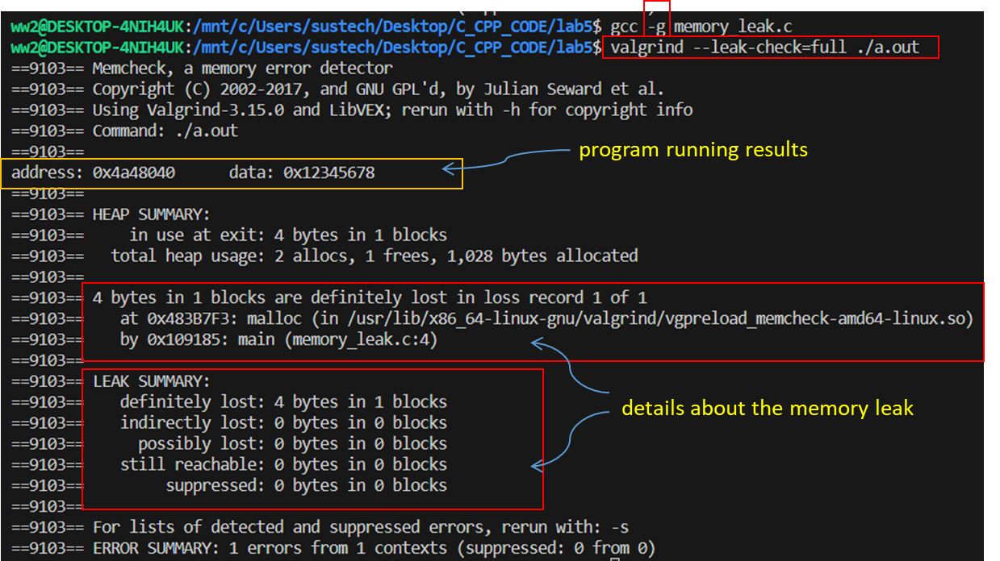
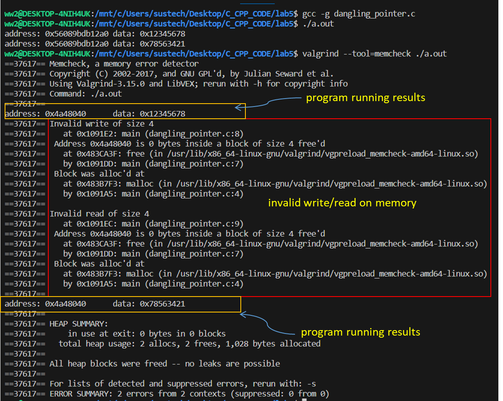
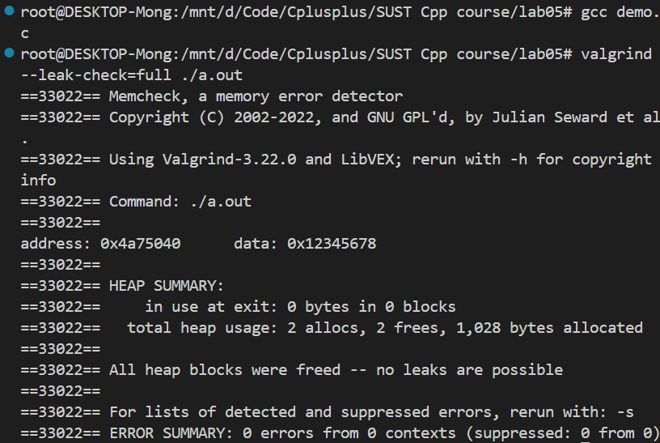
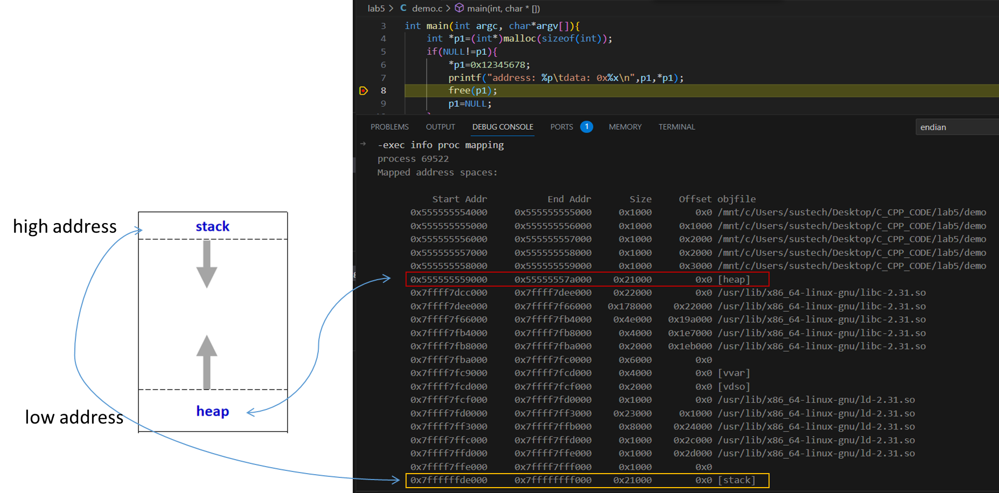
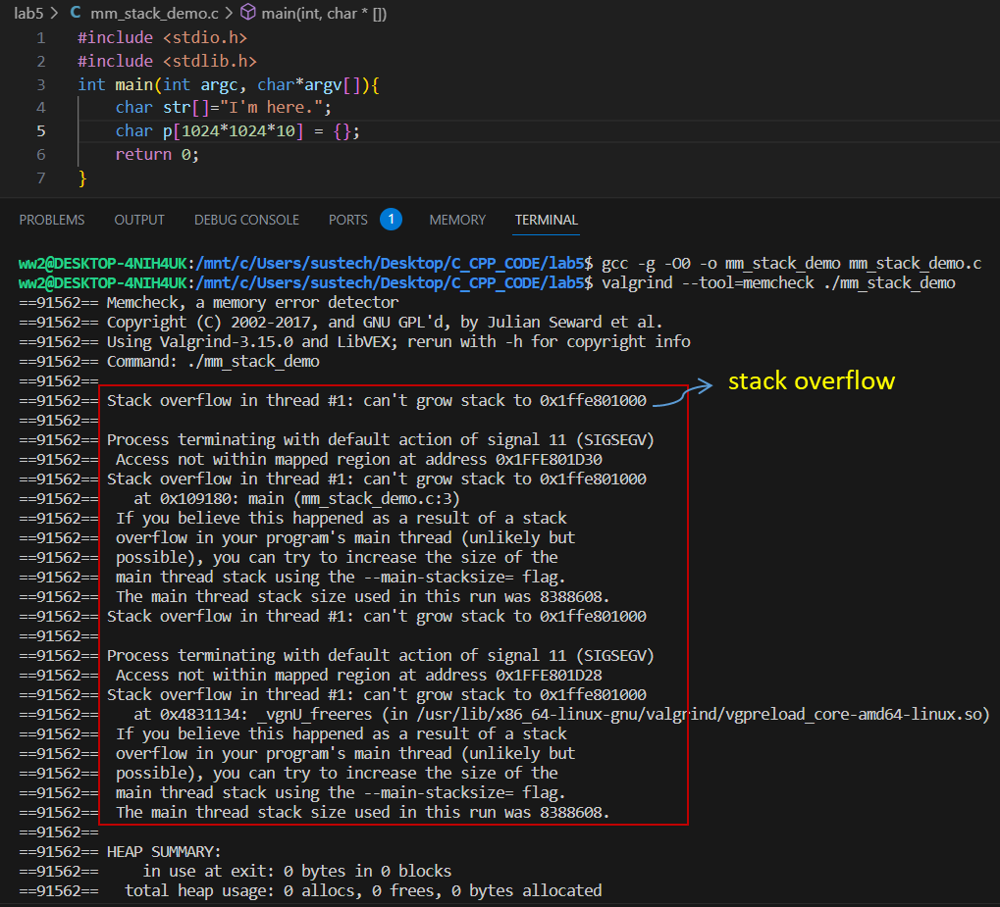
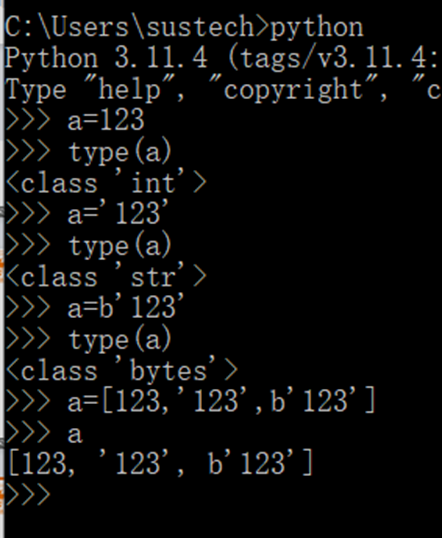
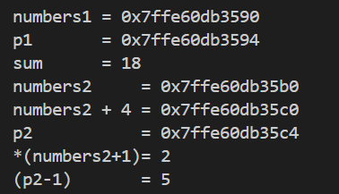

> [!TIP]
>
> Welcome to my CS205 lecture notes! Because the lecture is not in English, I will try my best to translate it.
>
> And at the same time, the `PPT`,`lab-file` also use the English,I will write **the English notes but not all.**

>[!NOTE]
>
>If you have a passion to konw more about the course, you can click the link below to learn more about the course.
>Read the repo.
>
>::github{repo="MongxinChan/CPP"}

> [!IMPORTANT]
>
> 由于本文篇幅过长，个人会添加适当的中文注解在里面。

**Introduction：**

Precautions for pointer 

- DON'T S

- Suggestion

    - Coding specification

    - Tool: valgrind 


Memory Management(1)

- Stack vs Heap
    - compiler+system vs programmer
- C/C++ vs Python
    - compiler vs interpreter
    - compiler+system+programmer vs interpreter+programmer

# Precautions for Pointer 

DON’TS

1. whild pointer

2. memory leak 

3. free less or free more

4. free stack

5. dangling pointer


Suggestion

- Coding specification
- Tools

## 1.1 wild pointer

We see the example:

```cpp
#include<stdio.h>   //wild_pointer.c
#include<stdlib.h>
int main(int argc, char* argv[]){
    int *p1;
    *p1=0x12345678;
    printf("address: %p\tdata: 0x%x\n",p1,*p1);
    return 0;
}

```

```cpp
#include<stdio.h>   //wild_pointer.c
#include<stdlib.h>
int main(int argc, char* argv[]){
    int *p1=NULL;
    *p1=0x12345678;
    printf("address: %p\tdata: 0x%x\n",p1,*p1);
    return 0;
}

```

**Wild pointers** refer to pointers that have not been initialized or have been released but are still in use. The positions pointed to by these pointers are uncertain, random, and have no clear limitations. 


**Wild pointers may cause program crashes or unpredictable results**, as the memory addresses they point to may already be occupied by other objects or programs, or reclaimed by the operating system

## 1.2 Memory leak

**Memory leak** refers to the waste of system memory **caused by dynamically allocated heap memory** in a program that is not released or cannot be released for some reason, resulting in **serious consequences such as slow program running speed or even system crashes**.


```cpp
#include<stdio.h>   //demo1.c
#include<stdlib.h>
int main(intargc, char* argv[]){
    int *p1=(int*)malloc(sizeof(int));
    *p1=0x12345678;
    printf("address: %p\tdata: 0x%x\n",p1,*p1);
    return0;
}

```


```cpp
#include<stdio.h>   //demo2.c
#include<stdlib.h>
int main(intargc, char* argv[]){
    int d1=0x12345678;
    int *p1=&d1;
    printf("address: %p\tdata: 0x%x\n",p1,*p1);
    return0;
}

```

Q: Which piece(s) of code would lead to memory leak? demo1.c, demo2.c or both ? 

只有 `demo1.c` 会导致内存泄漏，因为它动态分配了内存但没有释放。`demo2.c` 不会导致内存泄漏，因为它使用的是栈上的内存，栈上的内存会在函数返回时自动释放。

## 1.3 free more or free less 

```cpp
#include <stdio.h>  //free less
#include <stdlib.h>
int main(int argc, char*argv[]){
    int *p1 = malloc(sizeof(int)*1);
    int *p2 = malloc(sizeof(int)*1);
    *p1=0x12345678;
    *p2=*p1;
    printf(“p1:%p\tdata:0x%x\n"
           p2:%p\tdata:0x%x\n",p1,*p1,p2,*p2);
    free(p1);
    return 0;
}

```

```cpp
#include <stdio.h>    //free more
#include <stdlib.h>
int main(int argc, char*argv[]){
    int *p1 = malloc(sizeof(int)*1);
    *p1=0x12345678;
    int *p2 = p1;
    printf("p1:%p\tdata:0x%x\n
           p2:%p\tdata:0x%x\n",p1,*p1,p2,*p2);
    free(p1);
    free(p2);
    return 0;
}

```


Q. Which piece of code would lead to memory leak, which piece of code would lead to program abort with error?

- **free_more.c** 会导致程序崩溃或产生运行时错误，因为它尝试释放同一块内存两次。
- **free_less.c** 会导致内存泄漏，因为它没有释放所有动态分配的内存。

正确的做法是确保每一块动态分配的内存只被释放一次，并且所有动态分配的内存在使用完毕后都被正确释放。

## 1.4 free stack

```cpp
#include <stdio.h>
#include <stdlib.h>
int main(int argc, char*argv[]){
    int *p1=NULL;
    int d1=0x12345678;
    p1 = &d1;
    printf("address: %p\tdata: 0x%x\n",p1,*p1);
    free(p1);
    return 0;
}

```

Q1. What’s the value of p1 after finish the assignment “p1 = &d1;”?

- 赋值语句 `p1 = &d1;` 将 `d1` 的地址赋给了指针 `p1`。因此，`p1` 将指向局部变量 `d1` 的内存地址。`d1` 的值是 `0x12345678`，所以 `*p1` 也将是 `0x12345678`。

Q2. Is the address of P1 belongs to stack or heap?

- `p1` 是一个指针变量，它本身是在栈上分配的（因为它是在函数 `main` 的栈帧中声明的）。然而，`p1` 指向的地址（即 `&d1`）也是在栈上，因为 `d1` 是一个局部变量，局部变量默认存储在栈上。

Q3. While using free/del to release the space on stack, what would happen?

- 在 C 语言中，使用 `free` 释放栈上分配的内存是未定义行为。栈上的内存是由编译器自动管理的，当函数执行完毕后，栈上的局部变量所占用的内存会自动被释放。尝试使用 `free` 释放栈上的内存可能导致程序崩溃、内存损坏或其他不可预测的行为。
- 在 C++ 中，使用 `delete` 释放栈上分配的内存同样是未定义行为，并且可能导致类似的严重后果。


> [!TIP]
>
> 如果你需要动态分配内存，应该使用 `malloc`（或 C++ 中的 `new`）在堆上分配，然后使用 `free`（或 `delete`）来释放。对于栈上的局部变量，让编译器自动管理它们的生命周期。

## 1.5 dangling pointer

```cpp
#include <stdio.h>  //dangling_pointer
#include <stdlib.h>
int main(int argc, char*argv[]){
    int *p1 = (int*) malloc(sizeof(int)*1);
    *p1 = 0x12345678;
    printf("address: %p\tdata: 0x%x\n",p1,*p1);
    free(p1);
    *p1 = 0x78563421;
    printf("address: %p\tdata: 0x%x\n",p1,*p1);
    return 0;
}

```

在这段代码中，`p1` 指向一块通过 `malloc` 分配的内存。在调用 `free(p1);` 后，`p1` 变成了一个悬垂指针，因为它仍然指向已经被释放的内存。接着，代码尝试通过这个悬垂指针修改内存，这是未定义行为。未定义行为可能导致程序崩溃、数据损坏或其他不可预测的后果。

```cpp
#include <stdio.h>  //dangling_pointer
#include <stdlib.h>
int main(int argc, char*argv[]){
    int *p1 = (int*) malloc(sizeof(int)*1);
    *p1 = 0x12345678;
    printf("address: %p\tdata: 0x%x\n",p1,*p1);
    free(p1);
    p1=NULL;
    *p1 = 0x78563421;
    printf("address: %p\tdata: 0x%x\n",p1,*p1);
    return 0;
}

```


在这段代码中，`p1` 同样指向一块通过 `malloc` 分配的内存，并且在调用 `free(p1);` 后被设置为 `NULL`。尽管 `p1` 被设置为 `NULL`，但尝试通过 `*p1 = 0x78563421;` 访问内存仍然是未定义行为。在大多数系统中，尝试解引用 `NULL` 指针会导致程序立即崩溃，通常是通过抛出一个段错误（segmentation fault）。

> [!TIP]
>
> - 释放内存后，应该立即将指针设置为 `NULL`，以避免悬垂指针问题。
> - 通过 `NULL` 指针访问内存是未定义行为，通常会导致程序崩溃。
> - 正确管理内存和指针是编写可靠程序的关键。
>
> 为了避免悬垂指针和未定义行为，建议在释放内存后立即将指针设置为 `NULL`，并在使用指针之前检查它是否为 `NULL`。

## 1.6 valgrind

**Valgrind** is an instrumentation framework for building dynamic analysis tools. There are Valgrind tools that can **automatically detect many memory management and threading bugs, and profile your programs in detail.** You can also use Valgrind to build new tools.

You can use above the command to install:

```bash
sudo apt install valgrind -y
valgrind --version
```


[You can click here to visit](https://valgrind.org/)


```cpp
#include<stdio.h>   //memory_leak.c
#include<stdlib.h>
int main(int argc, char*argv[]){
    int *p1=(int*)malloc(sizeof(int));
    *p1=0x12345678;
    printf("address: %p\tdata: 0x%x\n",p1,*p1);
    return0;
}

```


step1. using “-g” option along with gcc/g++ to generate the executable file.

```bash
gcc memory_leak.c
```

step2. invoke valgrind with “--leak-check=full” as option, the executable file as parameter to check the memory leak on the executable file.

```bash
valgrind --leak-check=full ./a.out
```



```cpp
#include <stdio.h>  //dangling_pointer
#include <stdlib.h>
int main(int argc, char*argv[]){
    int *p1 = (int*) malloc(sizeof(int)*1);
    *p1 = 0x12345678;
    printf("address: %p\tdata: 0x%x\n",p1,*p1);
    free(p1);
    *p1 = 0x78563421;
    printf("address: %p\tdata: 0x%x\n",p1,*p1);
    return 0;
}

```



> [!NOTE]
>
> The program can be executed and the results appear correct, but it brings greater risks!!!

## 1.7 Coding specification

```cpp
#include<stdio.h>   //demo.c
#include<stdlib.h>
int main(int argc, char*argv[]){
    int *p1=(int*)malloc(sizeof(int));
    if(NULL!=p1){
        *p1=0x12345678;
        printf("address: %p\tdata: 0x%x\n",p1,*p1);
        free(p1);
        p1=NULL;
    }
    return 0;
}

```

1. check if malloc/new is successful
2. don’t forget to free/del the space 
3. assign NULL to the pointer after del/free the related space



# Memory Management

## 2.1 Memory Managment-Stack vs Heap

Both Stack and heap belongs to dynamic memory area. 

- Stack: LIFO, expand from high address to low address.

- heap: expand from low address to high address.




```cpp
#include <stdio.h>
#include <stdlib.h>
int main(int argc, char*argv[]){
    char str[]="I'm here.";
    char p[1024*1024*10] = {};
    return 0;            
}

```



Requesting a large space in the **stack** space may lead to stack overflow.

In this demo, the size of the space is 1024 * 1024 * 10 sizeof char.

The space on stack for C/C++ is managed by Compiler and the system.

Q. Smaller the size of char array `p`, such as 1024*10, generate the executable file and use valgind again, what’s the result?

减小数组大小可以减少栈溢出的风险，但最佳实践是尽可能将大型数据结构放在堆上，而不是栈上。在C中，你可以使用 `malloc` 在堆上分配内存；在C++中，可以使用 `new` 或者容器类如 `std::vector`。这样可以更有效地管理内存，并减少栈溢出的风险。


```cpp
#include <stdio.h>
#include <stdlib.h>
int main(int argc, char*argv[]){
    char str[]="I'm here.";
    char *p = (char*)malloc(sizeof(char)*1024*1024*10);
    if(p!=NULL){
        free(p);
        p=NULL;  
    }  
    return 0;            
}

```


Requesting a large space in the **heap** space would not lead to heap overflow.

In this demo, the size of the space is 1024 * 1024 * 10 sizeof char.

The space on heap for C/C++ is managed by programmer.

## 2.2 Memory Managment-C/C++ VS Python

|                      | **C/C++**                                                    | **Python**                                                   |
| -------------------- | ------------------------------------------------------------ | ------------------------------------------------------------ |
| Language Type        | Compiled                                                     | Interpreted                                                  |
| Operating efficiency | Faster,  real time                                           | Slower                                                       |
| Static/dynamic type  | Static type languages determine  variable types at compile time | Dynamic type languages determine  variable types at runtime. |
| Memory Mangment      | 1. Compiler + System for non-heap space    2. programmer for heap | 1. interpreter for most situation    2. garbage collector used by programmer  for very few situation |
| others               | ...                                                          | ...                                                          |



[You can click here to visit the website of memory in python](https://docs.python.org/3/c-api/memory.html)

# Exercise

## 3.1 Exercise

```cpp
#include<stdio.h>
int main() 
{ 
    int numbers1[] = {2,4,6,8,10};
    int sum = 0;
    int *p1 = &numbers1[1];
    printf("numbers1 = %p\n", numbers1);
    printf("p1       = %p\n", p1);
    for(int i = 0; i < 3; i++) 
        sum += *(p1+i);
    printf("sum      = %d\n",sum);

    int numbers2[5]={1,2,3,4,5};
    int *p2 = (int*)(&numbers2 + 1);
    printf("numbers2     = %p\n", numbers2);
    printf("numbers2 + 4 = %p\n", numbers2 + 4);
    printf("p2           = %p\n", p2);
    printf("*(numbers2+1)= %d\n",*(numbers2+1));
    printf("(p2-1)       = %d\n",*(p2-1));
    return 0;
}

```

Run the program and explain the result to SA. 



`p1`指向`numbers1`的第`1`个元素，sum为从p1开始遍历了三个数，即4，6，8相加得到18.

`p2`是由于+1，相当于略过了另一个int[5]的内存空间。所以`p2`指向的是numbers2下一个int[5]数组的内存空间，`*(p2-1)` 访问 `p2` 指向位置前一个元素的值，即 `numbers2` 的最后一个元素，值 `5`。

## 3.2 Exercise

```cpp
#include <iostream>
using namespace std;
int main()
{
    int matrix[][4] = {1,3,5,7,9,11,13,15,17,19}; 
    int *p = *(matrix + 1);
    p += 3;
    cout << "*p++ = " << *p++ << endl; 
 
    const char *str = "Welcome to programming.";
    long *q = (long *)str;
    q++;
    char *r = (char *)q;
    cout << r << endl;

    unsigned int num = 0x3E56AF67;
    unsigned short *pshort = (unsigned short *) &num;
    cout << "*pshort = 0x" <<  hex << *pshort << endl;
    return 0;
}

```

Run the program and explain the result to SA. 


由于matrix本质上是由多个一维数组组成的二维数组，所以相当于p++指向的是下一个一维数组的地址。

`(long *)str` 将 `str` 转换为 `long` 类型的指针，这可能导致未对齐的访问，因为字符串可能不是以 `long` 类型大小对齐的。`q++` 将 `q` 向后移动一个 `long` 类型的元素，这可能跳过多个 `char` 类型的元素，具体取决于 `long` 的大小（通常是4或8字节）。`(char *)q` 将 `q` 转换回 `char` 类型的指针。输出结果取决于 `q` 移动后指向的字符串内容，这可能是字符串的后半部分，也可能是乱码，因为未对齐的访问可能导致内存损坏。

`num` 是一个 `unsigned int` 类型的变量。`(unsigned short *)&num` 将 `num` 的地址转换为 `unsigned short` 类型的指针。这里没有指定是指向 `num` 的哪个部分，这可能导致未对齐的访问。`*pshort` 访问 `num` 的低16位（假设 `unsigned short` 是16位）。由于 `num` 的值是 `0x3E56AF67`，低16位是 `0xAF67`。

## 3.3 Exercise

```cpp
#include <stdio.h>
#include <stdlib.h>
int main(int argc, char *argv[]){
    int numA = 0x11223344;
    if(argc == 2){
        if(argv[1][0]=='H'){
            int *pnumB = (int*)malloc(sizeof(int));
            if(pnumB!=NULL){
                /*complete code here*/
            } 
        }
        else if(argv[1][0]=='S'){
            /*complete code here*/
        }
    }
    return 0;
}

```

- 3-1. Complete the code on the right to finish the following task:

    1. Determine whether the current system is in big-endian(BE) or little-endian(LE) based on the storage location of byte0 in numA.

    2. Store each byte in numA to a new space (numB or pointed by pnumB) in reverse order.

        - If the command-line parameter of the program is ‘H’, use heap mode to implement swapping. 

        - If the command-line parameter of the program is ‘S’, use stack mode to implement swapping.

        - Print out the value of numB (or pointed by pnumB) in hexadecimal.

- 3-2. Use the tool valgrind to check if there is memory problem on the code. 

Its my Implement:

```cpp
#include <stdio.h>
#include <stdlib.h>

int main(int argc, char *argv[]){
    int numA = 0x11223344;
    unsigned char byte0 = (unsigned char)(numA & 0xFF); // 提取最低有效字节

    // 检测系统字节序
    printf("Data A_addr: 0x%p, A_data: 0x%X, This is ", (void*)&numA, numA);
    if (byte0 == 0x44) {
        printf("LE\n"); // Little-Endian
    } else {
        printf("BE\n"); // Big-Endian
    }

    if(argc == 2){
        if(argv[1][0]=='H'){
            int *pnumB = (int*)malloc(sizeof(int));
            if(pnumB != NULL){
                // 堆模式：反转字节顺序
                *pnumB = ((numA >> 24) & 0xFF) | ((numA << 8) & 0xFF0000) | ((numA >> 8) & 0xFF00) | (numA << 24);
                printf("Data B_addr: 0x%p, B_data: 0x%X\n", (void*)pnumB, *pnumB);
                free(pnumB); // 释放分配的内存
            } else {
                printf("Memory allocation failed.\n");
            }
        }
        else if(argv[1][0]=='S'){
            // 栈模式：反转字节顺序
            int numB = ((numA >> 24) & 0xFF) | ((numA << 8) & 0xFF0000) | ((numA >> 8) & 0xFF00) | (numA << 24);
            printf("Data B_addr: 0x%p, B_data: 0x%X\n", (void*)&numB, numB);
        }
    }
    return 0;
}
```


# Tips on Big-Endian and Little-Endian

**BE** stores the big-end first, the lowest memory address is the biggest.

**LE** stores the little-end first, the lowest memory address is the littlest. 


```cpp
#include<stdio.h>
union data
{
    int a;
    char c;
};

int main()
{
    union data endian;
    endian.a = 0x11223344;

    if(endian.c == 0x11)
        printf("Big-Endian\n");
    else if(endian.c == 0x44)
        printf("Little-Endian\n");

    return 0;
}

```

Q: Run the demo on your system, is your system Big-Endian or Little-Endian?

在g++ (Ubuntu 13.3.0-6ubuntu2~24.04) 13.3.0环境下为小端。

> [!NOTE]
>
> 关于记忆技巧，我认为这方面只需要你能联想到**Big**的**Better in golden**，**Big-Endian就是高位字节排放在内存的低地址端，低位字节排放在内存的高地址端。**即金本位后银才放置在其后面。
>
> - **Big-Endian（大端序）**：就像黄金（gold）因其价值高而放在前面一样，高位字节（最重要的数据）被放在内存的低地址端，而低位字节（价值相对较低的数据）则放在内存的高地址端。这种排列方式确保了最重要的信息（“黄金”）位于最容易访问的位置（“前面”）。
> - **Little-Endian（小端序）**：与 Big-endian 相反，低位字节（价值较低的数据）放在内存的低地址端，而高位字节（最重要的数据）放在内存的高地址端。这可以类比为先放置银子（价值较低），然后再放置黄金（价值较高）。
