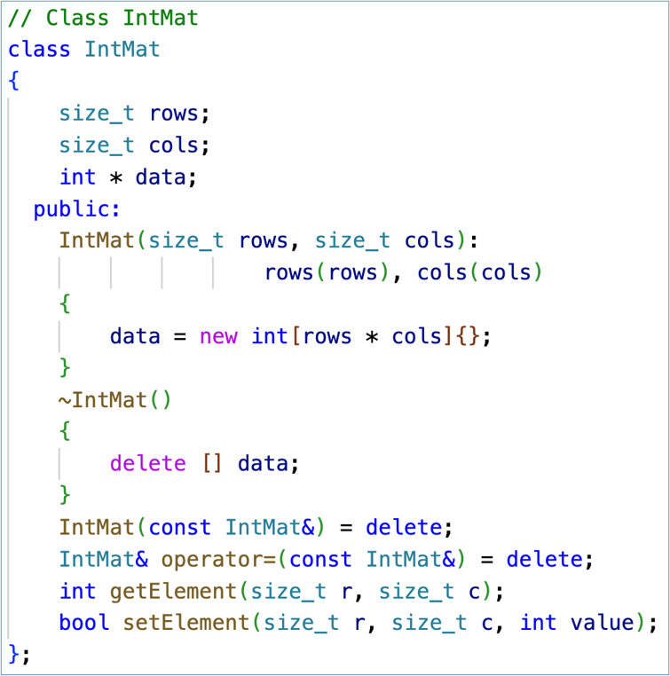
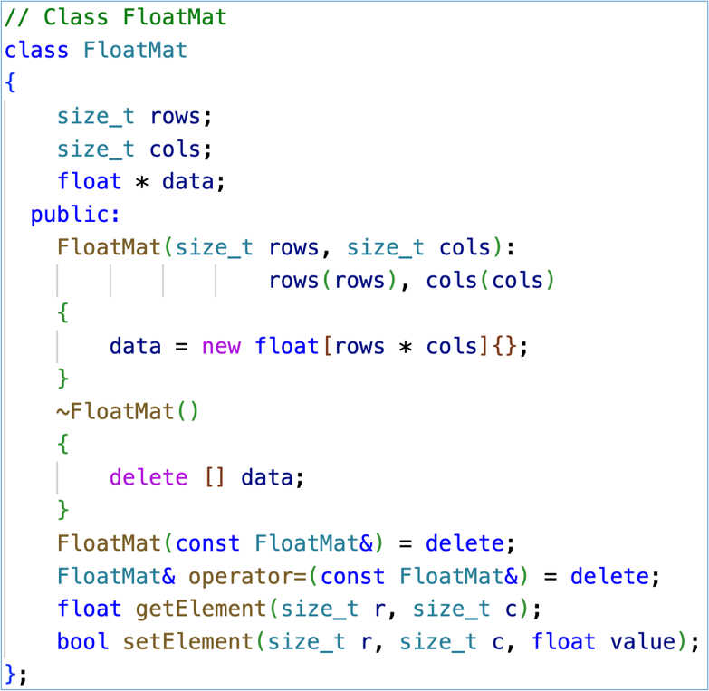

# Class Template

## Review:Function templates
- A function template is not a type, or a function, or any other entity. 
- No code is generated from a source file that contains only template definitions.
- The template arguments must be determined, then the compiler can generate an actual function
- **"Function templates"** vs **"template functions"**.

```cpp
template<typename T>
T sum(T x, T y)
{
    cout << "The input type is " << typeid(T).name() << endl;
    return x + y;
}

```

You found that the function template is not a function, it is `like-a-bone` . 

```cpp
// instantiates sum<double>(double, double)
template double sum<double>(double, double);
// instantiates sum<char>(char, char), template argument deduced
template char sum<>(char, char); 
// instantiates sum<int>(int, int), template argument deduced
template int sum(int, int); 

```

- template functions are like a `implementation`(instantiated) of the function template.


### implicit instantation occurs when a function template is not explicitly instantiated.
```cpp
template<typename T>
T product(T x,T y){
    cout << "The input type is " << typeid(T).name() << endl;
    return x*y;
}

//implicitly instantiated product<int>(int,int)
cout<<"product = "<<product<int>(1.2f,2.3f)<<endl;
//implicitly instantiated product<double>(double,double)
cout<<"product = "<<product(1.2f,2.3f)<<endl;
```


## Different Classes for Different Type Matrices
- Matrix with **int** elements,Matrix with **float** elements.

    

    